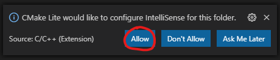
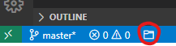

# CMake Lite for Visual Studio Code

The CMake Lite extension provides a minimal integration of CMake workflow into Visual Studio Code. It lets you build and configure CMakes projects using the command line. Without any time consuming configuration, it provide the project informations to the C/C++ extension. Open a workspace with an already configured cmake build directory and enjoy IntelliSense.

## Features

* It is not a CMake wrapper.
* Selection of the active project from the status bar.
* Selection of the last configured project from a command.
* Watch for changes in the active project.

## Requirements

CMake version 3.14 or higher must be installed.

**Warning**: This extension is not compatible with other CMake extensions like [CMake Tools](https://github.com/microsoft/vscode-cmake-tools) nor [CMake Integration](https://github.com/go2sh/cmake-integration-vscode).

## Getting started

* Install the extension.
* Open a workspace with a cmake build directory.
* Allow the extension to provide informations to the C/C++ extension. Click `Allow` button on the notification or add `"C_Cpp.default.configurationProvider": "numaru.vscode-cmake-lite"` to your global `settings.json`.

* Run a cmake configure from a terminal. e.g. `cmake build_dir`.
* Click on the status bar button to the select your project.

* Enjoy IntelliSense.

## Configuration

None.

## Commands

ID | Command
--- | ---
vscode-cmake-lite.selectActiveProject | Open a panel to select the active project
vscode-cmake-lite.activateProject(uri) | Activate the given project
vscode-cmake-lite.activateLastProject | Activate the last configured project

## Known Issues

### I cannot delete/rename my build directory

The extension use a file watcher on the build directory of the active project. The watcher can block the deletion of the folder. Before deleting, you might want to deselect all projects using the `selectActiveProject` command from the command palette or the status bar button.

### My newly created build directory is not detected by the extension

The extension use the CMake file API, never launch a cmake command and does not watch the whole workspaces. As a consequence, the extension require to execute the following sequence on a build directory creation.

* Create the build directory from the command line. e.g. `cmake -S . -B build -G Ninja`
* Launch the `selectActiveProject` command from the command palette or the status bar button.
* Close the palette if your project is not detected.
* Run a second cmake build step. e.g. `cmake build`.
* Your project can now be selected from the `selectActiveProject` command.
